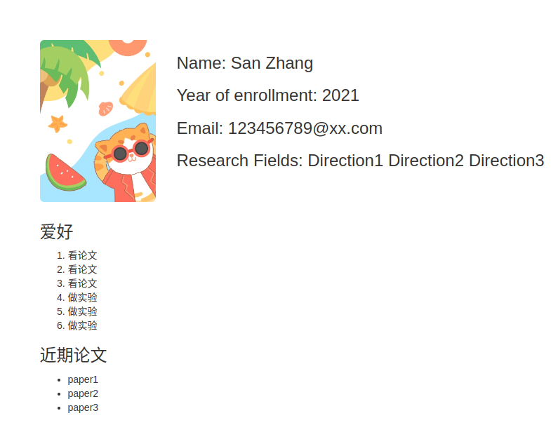

# 简介
此项目为 SNG（厦门大学系统与网络课题组）网站，基于 [Jekyll](https://jekyllrb.com/) 框架进行开发，同时使用了 [Bootstrap3](https://v3.bootcss.com/) 和 [JQuery](https://jquery.com/) 等前端框架。

# 使用或完善这个模板
如果你想使用或者完善这个模板，可以按照如下步骤：

## 1. 配置本地 Jekyll 环境

推荐使用Linux系统来配置环境，这里以 Ubuntu为例，其他系统参考[Jekyll 官方文档](https://jekyllrb.com/docs/)。
在终端依次输入如下命令：

```terminal
sudo apt-get install ruby-full build-essential zlib1g-dev
```

```terminal
echo '# Install Ruby Gems to ~/gems' >> ~/.bashrc
echo 'export GEM_HOME="$HOME/gems"' >> ~/.bashrc
echo 'export PATH="$HOME/gems/bin:$PATH"' >> ~/.bashrc
source ~/.bashrc
```

```terminal
gem install jekyll bundler
```

使用如下命令来验证是否安装成功：

```
ruby -v

gem -v

gcc -v

make -v
```
如果显示版本号则证明各个组件都已安装成功。

## 2. 使用这个模板
克隆此仓库到本地 `git clone`

```
cd 项目根目录
```

```
jekyll server
```

在本地 `http://localhost:4000` 打开这个站点，进行预览。

其中 `_site` 文件夹下的内容就是我们要部署的网页。

### 


# 使用这个站点

该项目预留了一些配置项，方便你使用站点，其中包括：

1. 增加或去掉一个导航项
2. 自定义首页轮播图
3. 新增一则 News
4. 新增一项 Publication(or Paper)
5. 新增一位成员
6. 新增一个研究方向
7. 更改 `footer` 内容

## 1. 增加或去掉一个导航项

打开 `/_data/navigation.yml`

```yml
- name: Home
  link: /
- name: People
  link: /people.html
- name: Research
  link: /research.html
- name: Publication
  link: /publication.html
- name: News
  link: /news.html
- name: Contact
  link: /contact.html
```


|    属性名    |    描述         |    是否必填    |
| :---------: | :---------:     | :---------: |
| name        | 导航名，也就是页面中展示的导航名| 必填 |
| link        | 该导航项对应的地址| 必填|


**增加一个导航项**

比如要增加一个导航项 `Activity` 用来展示近期的活动。首先在根目录下创建一个HTML文件 `activity.html` 并添加如下头信息：

```
---
layout: default
title: Activity
---
```

把该导航项添加到 `/_data/navigation.yml` 中：

```yml
- name: Home
  link: /
- name: People
  link: /people.html
- name: Research
  link: /research.html
- name: Publication
  link: /publication.html
- name: News
  link: /news.html
- name: Contact
  link: /contact.html
- name: Activity
  link: /activity.html
```
然后你就可以编写相关逻辑来展示你的活动了。


此外，主页中导航项的展示顺序与 `navigation.yml` 中的顺序一致。

**删除一个导航项**

如果你想要隐藏或删除一个导航项，直接在 `navigation.yml` 中删除对应的导航项即可。

## 2. 自定义首页轮播图

打开 `_data/swiper.yml`.


```yml
- swiperImg: /assets/images/swiper.jpeg
  title: "Title 1"
  active: true

- swiperImg: /assets/images/swiper.jpeg
  title: "Title 2"
  active: false

- swiperImg: /assets/images/swiper.jpeg
  title: "Title 3"
  active: false

```

|    属性名    |    描述    |    是否必填    |
| :---------: | :---------: | :---------: |
| swiperImg   | 图片地址，可以是本地图片，也可以是网络图片| 必填 |
| title        | 对应图片的说明| 选填|
| active        | 是否作为首先展示的图片，**有且只能有一张图片的 active 属性为 true，其余为 false**| 必填|


## 3. 新增一则 News

在 `_posts` 文件夹下创建一个 `Markdown` 文件，命名规则为 `YYYY-mm-dd-nn`，其中 `YYYY` `mm` `dd` `nn` 分别表示年份、月份、序号(当天发的第几则 News)。比如，2022年10月7号第一则 News 对应的 `.md` 文件应当命名为 `2022-10-07-01.md`.

创建完 `.md` 文件之后，复制以下头信息到文件中，

```yml
---
layout: post
author: 
title: 
date: 
coverImg: 
---

```


|    属性名    |    描述    |    是否必填    |
| :---------: | :---------: | :---------: |
| layout   | 页面所用样式，必须填写 `post`| 必填 |
| author        | News 作者名| 选填|
| title        | News 标题| 必填|
| date        | News 发表日期，格式：`YYYY-mm-dd HH:MM`| 必填|
| coverImg        | News 封面图片，可以是本地图片，也可以是网络图片，如果不填将显示默认图片，可在资源文件夹中设置默认图片| 选填|


示例：


```yml
---
layout: post
author: SNG
title: 厦门大学系统与网络课题组的一项研究成果被HotNets'22录用，提出一种分布式网络设备自验证框架
date: 2022-09-28 18:15
coverImg: /assets/images/news_img1.png
---

```

填写完头信息之后就可以在头信息下面撰写 News 具体内容了，系统会将 News 的第一段自动提取为摘要显示在主页。


## 4. 新增一项 Publication(or Paper)

打开 `_data/paper.yml`.

```yml
- title: Title2
  time: 2021
  display: 0
  authors: authors
  link: http://qiaoxiang.me/courses/cnns-xmuf22/files/lectures/1-introduction.pdf

- title: Title2
  time: 2020
  display: 1
  authors: authors
  link: http://qiaoxiang.me/courses/cnns-xmuf22/files/lectures/1-introduction.pdf

- title: Title2
  time: 2021
  display: 0
  authors: authors
  link: http://qiaoxiang.me/courses/cnns-xmuf22/files/lectures/1-introduction.pdf

- title: Title2
  time: 2020
  display: 0
  authors: authors
  link: http://qiaoxiang.me/courses/cnns-xmuf22/files/lectures/1-introduction.pdf

- title: Title1
  time: 2022
  display: 0
  authors: authors
  link: http://qiaoxiang.me/courses/cnns-xmuf22/files/lectures/1-introduction.pdf
```

属性说明：

|    属性名    |    描述    |    是否必填    |
| :---------: | :---------: | :---------: |
| title   | 论文标题| 必填 |
| time        | 发表时间| 必填|
| display        | 是否在主页显示，0表示不显示，1表示显示| 必填|
| authors        | 论文作者 | 必填|
| link        | 论文链接| 选填|


此外，如果论文发表在一个新的年份时，学要在 `publication.html` 中的指定位置添加如下代码，其中 `Year` 字段表示新的年份（这样做有些繁琐，后续会优化--todo）。

```html
<div class="col-lg-12" style="word-break:break-all;">
    <h2>Year</h2>
</div>

    
    <div class="col-lg-12 paper-item">
        <h4>{{item.title}}</h4> 
        <h5>{{item.authors}} </h5>
        <a href="{{item.link}}">This is a link.</a>
    </div>
    

```


## 5. 新增一位成员

加入你要新增一位名为 `张三` 的成员，这时你需要进入 `_authors` 文件夹并创建一个 `Markdown` 文件，命名为 `SanZhang.md`，在该文件中添加如下头信息：

```yml
---
name: San Zhang 
type: Master
sortWeight: 1
homePage: 
email: 123456789@xx.com
ResearchFields: Direction1 Direction2 Direction3
avatarUrl: /assets/images/SanZhang.jpeg
---
```

属性说明：

|    属性名    |    描述    |    是否必填    |
| :---------: | :---------: | :---------: |
| name   | 成员姓名| 必填 |
| type        | 成员类型，一共三种类型：Faculty PhD Master，分别代表导师、博士生、硕士生| 必填|
| startYear        | 入学年份| 选填|
| sortWeight        | 排序权重，范围：1-50，数值越小越靠前| 必填|
| homePage        | 主页链接，如果你没有个人主页，那么次页面将会渲染成你的个人主页（样式见下方图片） | 选填|
| email        | 邮箱地址| 选填|
| ResearchFields        | 研究领域| 选填|
| avatarUrl        | 个人照片| 暂时必填|


如果 `SanZhang.md` 的内容如下：


```markdown
---
name: San Zhang 
type: Master
sortWeight: 1
homePage: 
email: 123456789@xx.com
ResearchFields: Direction1 Direction2 Direction3
avatarUrl: /assets/images/SanZhang.jpeg
---

### 爱好

1. 看论文
2. 看论文
3. 看论文
4. 做实验
5. 做实验
6. 做实验

### 近期论文
* paper1
* paper2
* paper3
```

那么 `张三` 的个人主页将会渲染成如下样式：



## 6. 新增一个研究方向

打开 `_data/direction.yml`.

```yml
- title: Direction 1
  subtitle: irection 1irection 1irection 1irection 1irection 1irection 1irection 1irection 1irection 1irection 1irection 1irection 1irection 1irection 1irection 1irection 1irection 1irection 1irection 1
  description: irection 1irection 1irection 1irection 1irection 1irection 1irection 1irection 1irection 1irection 1irection 1irection 1irection 1irection 1irection 1irection 1irection 1irection 1irection 1irection 1irection 1irection 1irection 1irection 1irection 1irection 1irection 1irection 1irection 1irection 1irection 1irection 1irection 1irection 1irection 1irection 1irection 1irection 1irection 1irection 1irection 1irection 1irection 1irection 1irection 1irection 1irection 1irection 1irection 1irection 1irection 1irection 1irection 1irection 1irection 1irection 1irection 1
  imgUrl: /assets/images/direction01.jpeg

- title: Direction 2
  subtitle: irection 1irection 1irection 1irection 1irection 1irection 1irection 1irection 1irection 1irection 1irection 1irection 1irection 1irection 1irection 1irection 1irection 1irection 1irection 1
  description: irection 1irection 1irection 1irection 1irection 1irection 1irection 1irection 1irection 1irection 1irection 1irection 1irection 1irection 1irection 1irection 1irection 1irection 1irection 1irection 1irection 1irection 1irection 1irection 1irection 1irection 1irection 1irection 1irection 1irection 1irection 1irection 1irection 1irection 1irection 1irection 1irection 1irection 1irection 1irection 1irection 1irection 1irection 1irection 1irection 1irection 1irection 1irection 1irection 1irection 1irection 1irection 1irection 1irection 1irection 1irection 1irection 1
  imgUrl: /assets/images/direction02.png

- title: Direction 3
  subtitle: irection 1irection 1irection 1irection 1irection 1irection 1irection 1irection 1irection 1irection 1irection 1irection 1irection 1irection 1irection 1irection 1irection 1irection 1irection 1
  description: irection 1irection 1irection 1irection 1irection 1irection 1irection 1irection 1irection 1irection 1irection 1irection 1irection 1irection 1irection 1irection 1irection 1irection 1irection 1irection 1irection 1irection 1irection 1irection 1irection 1irection 1irection 1irection 1irection 1irection 1irection 1irection 1irection 1irection 1irection 1irection 1irection 1irection 1irection 1irection 1irection 1irection 1irection 1irection 1irection 1irection 1irection 1irection 1irection 1irection 1irection 1irection 1irection 1irection 1irection 1irection 1irection 1
  imgUrl: /assets/images/direction03.png
```

属性说明：

|    属性名    |    描述    |    是否必填    |
| :---------: | :---------: | :---------: |
| title   | 方向名称| 必填 |
| subtitle        | 副标题| 选填|
| description        | 方向描述| 必填|
| imgUrl        | 该研究方向对应的图片，可以是本地图片，也可以是网络图片| 暂时必填|

## 7. 更改 `footer` 内容

可在 `_includes/footer.html` 中更改 `footer` 内容：

```html
<div class="sng_footer navbar-static-bottom">

    <p style="color: black;">©2021 - 2022 By SNG</p>

</div>
```
